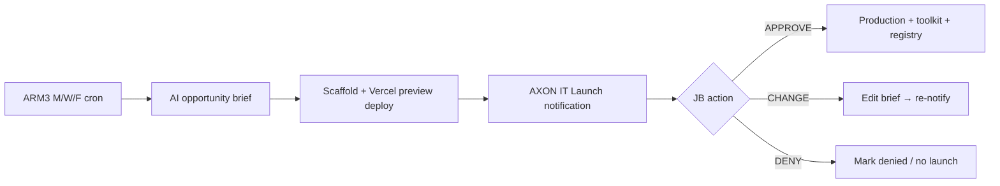

# Subagent Brief: ARM3-1 — Executive Launch Pipeline

**Runner name:** `NI Portal ARM3 Executive Launch - Subagent Runner`  
**Checker name:** `NI Portal ARM3 Executive Launch - Subagent Checker`  
**Branch:** `cursor/arm3-executive-launch-d298`

## Problem

ARM3 cron scaffolds repos but does not: generate ideas, send JB an executive summary, gate production launch, or wire AXON APPROVE/CHANGE/DENY.

## Target flow (M/W/F 10 AM ET)

## Executive summary fields (notification body)

Required in `arm3_it_launch_notifications` payload:

- Title (max 2 words, Sector 3 naming rules)
- Description (what it does)
- Target audience(s), B2B/B2C
- Subscription price + limited-time permanent purchase price
- Use cases
- Estimated revenue/month by EOY (model output + assumptions)
- Marketing strategy + rollout skeleton
- Competitors + differentiation
- **Preview URL** (Vercel preview — not production alias)

## Buttons

| Button | Action |
|--------|--------|
| **Approve** | Promote preview → production; add to master toolkit(s); `arm3_tools.status = live`; portal registry; AXON tool skeleton flag `axon_build_ready` |
| **Change** | Open edit form (summary fields); re-queue notification |
| **Deny** | `arm3_opportunities.status = denied`; teardown preview optional |

## Schema (new migration)

- `arm3_it_launch_notifications` — id, opportunity_id, tool_slug, payload jsonb, status, created_at
- Extend `arm3_opportunities`: `review_status` (`pending_review`|`approved`|`denied`|`changes_requested`), `preview_vercel_url`, `executive_summary` jsonb
- Extend `arm3_tools`: `lifecycle_phase` (`preview`|`production`|`archived`)

## Code touchpoints

| Area | Path |
|------|------|
| Discover + summary | New edge `arm3-discover-tool` or extend `generate-tool` phase 1 |
| Preview deploy | `github-scaffold.ts` + Vercel API (use `VERCEL_TOKEN` vault) |
| Cron | `.github/workflows/arm3-pipeline.yml` — discover → preview → notify (not auto-live) |
| AXON notification | `src/lib/axon/axon-types.ts` — `ItLaunchNotification` type |
| AXON UI | New `it-launch-notification-card.tsx` with 3 CTAs |
| APIs | `POST /api/axon/it-launch/[id]/approve|change|deny` |
| Toolkit | `syncMasterAccountToolkit()` on approve |

## Acceptance criteria

- [ ] M/W/F cron creates **preview only** — no production traffic
- [ ] Master sees executive summary in AXON notifications panel
- [ ] APPROVE makes tool visible on NI portal + master toolkit
- [ ] DENY does not appear on portal
- [ ] CHANGE persists edits and re-notifies
- [ ] `npm run build` passes
- [ ] Checker: 401 without AXON session on action APIs

## Stress tests

- Cron with zero opportunities → idle log, no crash
- APPROVE twice → idempotent
- Non-master → 403 on launch actions
- Invalid opportunity id → 404

## AXON Manager coordination

Notification card UI originates in AXON repo → sync via `sync-ni-portal.yml`. API routes stay in NI portal.
